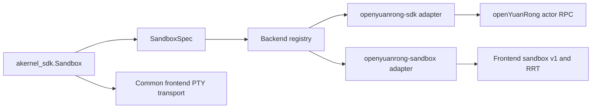

# RFC 0001: Multiple openYuanRong backends for the Python SDK

- Status: Draft
- Target: `akernel-sdk` 0.2
- Updated: 2026-07-26

## Summary

Make the public `akernel_sdk.Sandbox` API independent of the client protocol
used to create and operate a sandbox.

The first two backends will be:

- `openyuanrong-sdk`: the existing implementation based on the
  `openyuanrong-sdk` package and an openYuanRong actor.
- `openyuanrong-sandbox`: an HTTP/RRT implementation based on the
  `openyuanrong-sandbox` package.

Both backend packages become optional dependencies selected with matching
Python extras:

```bash
pip install "akernel-sdk[openyuanrong-sdk]"
pip install "akernel-sdk[openyuanrong-sandbox]"
pip install "akernel-sdk[all]"
```

Callers normally do not need to change their `Sandbox` usage when only one
backend is installed. They may select a backend explicitly when both are
available:

```python
from akernel_sdk import Sandbox

with Sandbox(
    backend="openyuanrong-sandbox",
    image="python:3.12-slim",
) as sandbox:
    print(sandbox.commands.run("python --version").stdout)
```

## Motivation

The current Python SDK describes its public API as backend-neutral, but the
implementation is coupled to `openyuanrong-sdk` in several places:

- package metadata installs `openyuanrong-sdk` unconditionally;
- `Sandbox` creates an openYuanRong actor directly;
- command operations call `yr.get`;
- filesystem operations call `yr.get` and use `yr.cli.exec` for bulk copy;
- named deletion and resource queries use openYuanRong SDK APIs.

openYuanRong now also provides `openyuanrong-sandbox`, which reaches the
frontend sandbox v1 API over HTTP and executes operations through the Rust
Runtime (RRT). It provides a smaller client dependency and a protocol designed
specifically for sandbox lifecycle, commands, files, and reverse tunnels.

AKernel should be able to use either client protocol without exposing
backend-specific objects through its public API.

## Goals

- Preserve the public `akernel_sdk.Sandbox`, `Commands`, `Filesystem`, `Pty`,
  and value-type APIs for features supported by both backends.
- Make both openYuanRong client packages optional dependencies.
- Use the same stable identifier for a backend extra, runtime selection, and
  error messages.
- Keep the current `openyuanrong-sdk` behavior as the compatibility default.
- Load backend dependencies lazily.
- Report unsupported features before a remote sandbox is created.
- Prevent automatic fallback from creating duplicate remote sandboxes.
- Test the same public contract against both backends.

## Non-goals

- Providing a general third-party plugin system in the first implementation.
- Exposing `yr_sandbox.Shell` through the AKernel public API.
- Making every current AKernel option work on the HTTP/RRT backend before the
  corresponding frontend protocol exists.
- Changing the node-side sandbox runtime implementation.
- Choosing between the gVisor and Kata runtimes automatically.

## Terminology

This RFC uses two independent meanings of runtime:

- **AKernel sandbox runtime**: the isolation runtime selected with
  `Sandbox(runtime=...)`, currently `runsc` or `kata`.
- **openYuanRong function runtime**: the frontend implementation that hosts
  sandbox actions, such as the Rust RRT runtime.

An adapter must not pass AKernel's `runtime="runsc"` or `runtime="kata"`
directly to `yr_sandbox.Sandbox.runtime`. That parameter selects an
openYuanRong function runtime, not the rootfs isolation runtime.

## Proposed package metadata

The common package retains only dependencies required by backend-neutral
features such as the AKernel PTY client:

```toml
[project]
dependencies = [
    "websockets>=10.0",
]

[project.optional-dependencies]
openyuanrong-sdk = [
    "openyuanrong-sdk==0.9.2",
]
openyuanrong-sandbox = [
    "openyuanrong-sandbox==0.9.2",
]
all = [
    "openyuanrong-sdk==0.9.2",
    "openyuanrong-sandbox==0.9.2",
]
```

The two versions are pinned independently in metadata but should be updated
together with the openYuanRong version used by AKernel deployments.

A bare `pip install akernel-sdk` remains useful for importing public value
types and the CLI, but constructing `Sandbox` requires one backend extra. This
installation-contract change is proposed for `akernel-sdk` 0.2.

## Backend identifiers and selection

The canonical identifiers are:

| Identifier | Extra | Python distribution |
| --- | --- | --- |
| `openyuanrong-sdk` | `openyuanrong-sdk` | `openyuanrong-sdk` |
| `openyuanrong-sandbox` | `openyuanrong-sandbox` | `openyuanrong-sandbox` |

The same strings are accepted by the constructor and environment variable:

```python
Sandbox(backend="openyuanrong-sdk")
Sandbox(backend="openyuanrong-sandbox")
```

```bash
export AKERNEL_BACKEND=openyuanrong-sandbox
```

Resolution uses this order:

1. the `backend=` constructor argument;
2. `AKERNEL_BACKEND`;
3. the only installed backend;
4. `openyuanrong-sdk` when both backends are installed.

Selecting `openyuanrong-sdk` when both packages are present preserves current
behavior. The resolved backend name is exposed as a read-only
`Sandbox.backend` property for diagnostics.

An unavailable explicit backend raises `BackendNotInstalledError` with the
matching installation command:

```text
Backend 'openyuanrong-sandbox' is not installed.
Install it with:
  pip install 'akernel-sdk[openyuanrong-sandbox]'
```

The implementation must not catch a backend creation failure and retry it with
another backend. The first request may have created a remote sandbox even when
the client did not receive the response.

## Public API changes

Add `backend` as the last optional constructor parameter:

```python
class Sandbox:
    def __init__(
        self,
        # Existing parameters remain unchanged.
        ...,
        backend: str | None = None,
    ) -> None: ...

    @property
    def backend(self) -> str: ...
```

Add the same optional selection to named deletion:

```python
Sandbox.delete("worker", backend="openyuanrong-sdk")
```

The new parameter is intentionally a string rather than a public backend
object. Backend construction, credentials, and lifecycle remain owned by the
AKernel SDK.

## Internal architecture

The public facade validates common arguments and creates a backend-neutral
specification. A lazy registry resolves the backend and returns a session that
supplies command and filesystem drivers.



The proposed source layout is:

```text
akernel_sdk/
├── sandbox.py
├── commands.py
├── filesystem.py
├── pty.py
├── types.py
└── _backends/
    ├── base.py
    ├── registry.py
    ├── openyuanrong_sdk.py
    └── openyuanrong_sandbox.py
```

`base.py` defines internal protocols and immutable configuration:

```python
class Backend(Protocol):
    name: str
    capabilities: frozenset[Capability]

    def create(self, spec: SandboxSpec) -> BackendSession: ...
    def delete_named(self, name: str) -> None: ...


class BackendSession(Protocol):
    id: str
    commands: CommandsDriver
    files: FilesystemDriver

    def is_running(self) -> bool: ...
    def state(self) -> str: ...
    def terminate(self) -> None: ...
    def close(self) -> None: ...
```

`Commands`, `CommandHandle`, and `Filesystem` remain public AKernel classes.
They delegate to internal drivers rather than importing `yr` themselves. This
ensures all public methods continue to return the frozen value types from
`akernel_sdk.types`.

The existing actor class and the `yr.get`/`yr.cli.exec` implementation move
behind the `openyuanrong-sdk` adapter without changing their behavior.

The `openyuanrong-sandbox` adapter wraps `yr_sandbox.Sandbox`, commands, and
filesystem objects and converts their results to AKernel value types.

## Configuration mapping

AKernel remains configured through its existing variables:

```text
AKERNEL_SERVER_ADDRESS
AKERNEL_GATEWAY_ADDRESS
AKERNEL_TOKEN
```

The `openyuanrong-sdk` adapter continues to initialize `yr.Config`.

The `openyuanrong-sandbox` package currently reads `YR_*` variables. The
adapter maps the parsed AKernel endpoints before constructing its client:

| AKernel configuration | openYuanRong sandbox configuration |
| --- | --- |
| API authority | `YR_SERVER_ADDRESS` |
| API TLS selection | `YR_TLS` |
| gateway authority | `YR_GATEWAY_ADDRESS` |
| gateway TLS selection | `YR_GATEWAY_TLS` |
| token | `YR_TOKEN` |

This bridge is process-global and must be guarded against conflicting
reconfiguration. A future `openyuanrong-sandbox` API should accept an explicit
connection object so the adapter can avoid environment mutation.

Credentials must not be included in backend-selection or capability errors.

## Capability model

The common facade performs type and value validation. The selected backend
then validates its capability-specific constraints before sending a create
request.

The first implementation uses an internal `Capability` enum and raises
`UnsupportedBackendFeatureError` when a requested feature is unavailable.
It must not silently drop, reinterpret, or downgrade an option.

The expected capability matrix for openYuanRong 0.9.2 is:

| Public feature | `openyuanrong-sdk` | `openyuanrong-sandbox` |
| --- | --- | --- |
| Lifecycle with OCI image | Supported | Supported |
| Commands and background stdin | Supported | Supported |
| File operations and bulk copy | Supported | Supported |
| User port forwarding | Supported | Supported |
| Read-only mounts | Supported | Supported |
| PTY over frontend WebSocket | Supported | E2E acceptance required |
| `runtime="runsc"` | Supported | Supported |
| `runtime="kata"` | Supported | Not currently representable |
| S3 EROFS rootfs | Supported | Not currently representable |
| `node_id` placement | Supported | Not currently representable |
| Create-time `cwd` | Supported | Accepted upstream but not applied |
| Detached lifecycle | Supported | Supported |
| Delete detached sandbox by name | Supported | No name-to-ID lookup |
| `schedule_timeout=-1` | Supported | Not supported |
| Reverse tunnel with default HTTP ports | Supported | Supported |
| Custom or HTTPS reverse-tunnel target | Supported | Not fully supported |

For example:

```text
Backend 'openyuanrong-sandbox' does not support runtime='kata'.
Select 'openyuanrong-sdk' or use runtime='runsc'.
```

The matrix describes the current client and frontend protocol, not permanent
product limitations. Capabilities can be enabled as those protocols evolve.

## Runtime mapping

For `openyuanrong-sdk`, `runtime` continues to be serialized in the rootfs
extension and may select `runsc` or `kata`.

For `openyuanrong-sandbox`:

- do not pass the AKernel runtime to `yr_sandbox.Sandbox.runtime`;
- leave the openYuanRong function-runtime selection at its RRT default;
- map `runtime="runsc"` to the structured rootfs runtime;
- reject `runtime="kata"` until the public sandbox create API can preserve
  that rootfs runtime instead of hard-coding `runsc`.

This distinction prevents a valid AKernel runtime from being interpreted as an
unsupported openYuanRong function runtime.

## Lifecycle details

`BackendSession.terminate()` terminates the remote sandbox, while
`BackendSession.close()` releases local backend resources without changing the
remote lifecycle. Keeping these operations separate prevents detached
sandboxes from leaking HTTP clients or other local resources.

The public facade remains responsible for:

- idempotent `kill()`;
- closing active PTY sessions;
- stopping reverse-tunnel client resources;
- respecting detached lifecycle;
- cleanup after a partially initialized public `Sandbox`.

For a non-detached sandbox, `kill()` calls `terminate()` and then `close()`.
For a detached sandbox, it calls only `close()`.

The adapter must retain the remote sandbox ID as soon as creation succeeds so
that later initialization failures can attempt best-effort cleanup.

Named deletion remains available only when the selected backend declares
`DELETE_BY_NAME`. The HTTP/RRT backend must not pass a name to an endpoint that
deletes by ID.

## Commands and filesystem

Public command behavior must remain identical:

- foreground calls return `akernel_sdk.CommandResult`;
- background calls return `akernel_sdk.CommandHandle`;
- timeout results use the existing exit-code conventions;
- process listings return `akernel_sdk.CommandInfo`;
- stdin errors remain explicit.

The actor backend retains `yr.get` and actor method invocation. The HTTP/RRT
backend delegates to `yr_sandbox.Commands` and converts native results.

Public filesystem behavior must also remain identical. The actor backend keeps
its actor RPC and exec-WebSocket copy paths. The HTTP/RRT backend uses the
frontend `/direct` binary upload/download implementation provided by
`openyuanrong-sandbox`.

Backend-native `CommandResult`, `EntryInfo`, and `SandboxInfo` classes must
never escape the adapter.

## PTY, ports, and tunnels

PTY currently talks directly to the AKernel frontend `/terminal/ws` route and
only needs the sandbox ID. It remains a common implementation rather than
being duplicated by each adapter. The HTTP/RRT backend is considered complete
only after this route passes its E2E contract with an RRT-created sandbox.

`Sandbox.get_port_url()` also remains in the common facade. It uses the stable
AKernel endpoint configuration and the physical sandbox ID returned by the
backend.

Reverse tunnels have different ownership models:

- the actor backend starts explicit tunnel ports inside its actor;
- the HTTP/RRT backend asks the frontend for a declarative tunnel and the
  frontend owns the internal ports.

The adapter may map the default AKernel HTTP tunnel configuration. It must
reject custom ports or HTTPS upstreams that the current
`openyuanrong-sandbox` client cannot preserve.

## Resources and CLI

Cluster resource queries and the `ak` administration commands are frontend
operations rather than sandbox execution backends. They should move to a
small backend-neutral admin client instead of requiring `yr.resources()`.

The first implementation does not add backend flags to `ak resources`,
`ak list`, `ak exec`, or ID-based `ak delete`. These commands already operate
on frontend resources or the common PTY protocol.

## Compatibility

Source compatibility is preserved for callers that install a backend extra.
Existing code without a `backend=` argument resolves to
`openyuanrong-sdk` when that package is installed.

The intentional packaging change is that a bare `pip install akernel-sdk` no
longer installs a backend. Release notes and installation examples must call
this out prominently.

Pickled private AKernel implementation objects are not a compatibility
contract. Public value types and method signatures remain the compatibility
surface.

## Testing

### Package installation matrix

CI will build the wheel and test four clean environments:

1. core package with no backend extra;
2. `[openyuanrong-sdk]` only;
3. `[openyuanrong-sandbox]` only;
4. `[all]`.

The core-only environment must import `akernel_sdk` and all public value types
without importing `yr` or `yr_sandbox`. Constructing a sandbox must report the
two valid installation commands.

The `[all]` environment verifies the compatibility default and both explicit
backend selections.

### Contract tests

A shared backend contract suite covers:

- option translation and unsupported-feature errors;
- lifecycle and idempotent cleanup;
- command result and process-handle conversion;
- filesystem value conversion;
- detached behavior;
- backend selection precedence;
- missing optional dependencies;
- prevention of automatic fallback.

Existing `openyuanrong-sdk` unit tests remain regression coverage for the
actor adapter.

### End-to-end tests

Each backend must pass, against a compatible AKernel deployment:

- create, readiness, and kill;
- foreground command;
- background command with stdin;
- text and binary file operations;
- file and directory copy;
- user port forwarding;
- PTY create, resize, input, and exit;
- default reverse tunnel;
- repeated cleanup with no residual sandbox.

Backend-specific cases cover S3 rootfs, Kata, node placement, and named
deletion only where the capability is advertised.

### Package validation

The release gate continues to run:

- unit tests;
- Ruff;
- mypy;
- wheel and source-distribution builds;
- wheel metadata inspection for the three extras.

## Rollout plan

1. Add the internal protocols, registry, errors, and package extras.
2. Move the existing implementation behind `openyuanrong-sdk` without changing
   behavior.
3. Run the existing SDK gate and E2E suite against that adapter.
4. Add the `openyuanrong-sandbox` adapter for the common capability subset.
5. Add the clean-environment package matrix and shared contract tests.
6. Run both E2E suites and document the remaining capability differences.
7. Release the packaging change with `akernel-sdk` 0.2.

No deployment configuration is changed merely by accepting this RFC.

## Alternatives considered

### Expose two public Sandbox classes

For example, `OpenYuanRongSandbox` and `RRTSandbox` would avoid an internal
interface, but application code would depend on the backend and receive
different value types. This conflicts with AKernel's backend-neutral public
API.

### Depend on both packages unconditionally

This avoids selection errors but keeps a large native dependency installed for
HTTP/RRT-only clients and does not satisfy the optional-dependency goal.

### Replace the existing backend immediately

The HTTP/RRT protocol does not yet represent all current AKernel features.
Replacing the actor backend would regress Kata, S3 rootfs, node placement, and
named deletion.

### Discover third-party backends through entry points

Python entry points are useful when external backend implementations exist.
For two built-in adapters they add public compatibility and security surface
without a current requirement. The internal protocol should not prevent a
future entry-point registry.

## Open questions

1. Should backend-less installation be introduced directly in 0.2, or should
   one release first add the extras while retaining the current mandatory
   dependency?
2. Should `openyuanrong-sandbox` accept an explicit connection object before
   AKernel adopts it, avoiding the process-global `YR_*` environment bridge?
3. Should structured S3 rootfs and Kata rootfs runtime fields be added to the
   frontend sandbox v1 request before the first AKernel HTTP/RRT release?
4. Should name lookup be added to sandbox v1, or should AKernel deprecate
   name-based class deletion in favor of deletion by sandbox ID?
